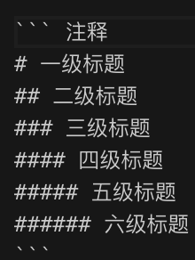

此文档是在已经建立好`Hexo`博客的前提

# 标题

``` 注释
# 一级标题
## 二级标题
### 三级标题
#### 四级标题
##### 五级标题
###### 六级标题
```

# 图片

``` 


```

当找不到目标图片, 显示[]中的文字


# 代码块
使用```


# 链接

```
[Hexo语法](https://zhuchuanlei.github.io/blog/Hexo语法/)
[Hexo语法]: https://zhuchuanlei.github.io/blog/Hexo语法/
```
[Hexo语法](https://zhuchuanlei.github.io/blog/Hexo语法/)
[Hexo语法]: https://zhuchuanlei.github.io/blog/Hexo语法/
```
# 分割线

```
***
---
___
```

***
---
___

# 表格

代码:

```
| name | age | sex |
|:----:|:---:|:---:|
| Peter | 18 | 男 |
| Petter | 19 | 男 |
| Tony | 19 | 男 |
```

样式:

| name | age | sex |
|:----:|:---:|:---:|
| Peter | 18 | 男 |
| Petter | 19 | 男 |
| Tony | 19 | 男 |

代码:

```
 name | age | sex 
 -|-|-
 Peter | 18 | 男 
 Petter | 19 | 男
 Tony | 19 | 男 
```

样式:

 name | age | sex 
 -|-|-
 Peter | 18 | 男 
 Petter | 19 | 男
 Tony | 19 | 男 
