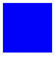
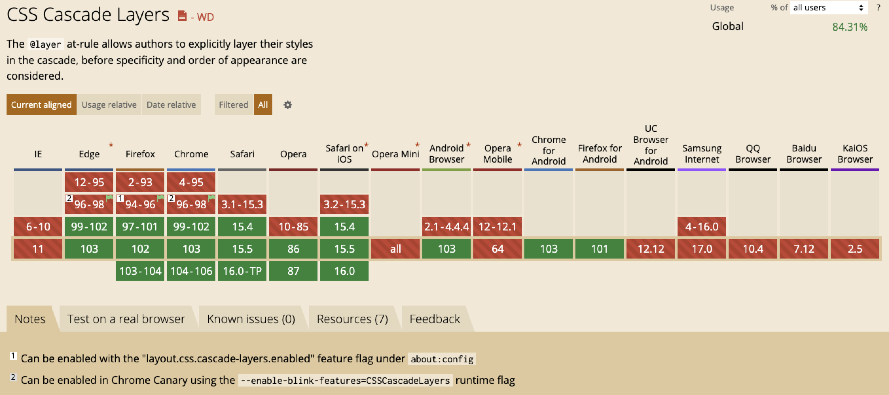

## 1. 写在前面

你是不是有时候会被样式覆盖问题所困绕？写了样式但是不生效，检查一下发现被一个权重更高的覆盖了。

所以开始加权重，增加类，甚至经常用`!important`。

项目代码越来越多时，`!important`也跟着多了起来，后面又该怎么整理呢？

## 2. 级联层

`CSS`出现一个新规则：`@layer`。它声明了一个 *级联层*,  同一层内的规则将级联在一起， 这给予了开发者对层叠机制的更多控制。

⚠️ 不同级联层内的属性，无权重之分

> 举个例子

看这个例子，如果同时为同一个`div`设置`background-color`属性，肯定是展示下面的颜色，因为*相同层级，后面的生效*，背景色是红色。

通过用`@layer`声明了层级后，最终样式可以被控制的。

```css

/* html 
  <div id='test' class='test'></div>
*/

/* css */
@layer R, B;
@layer B {
  div {
    background-color: blue;
  }
}
@layer R {
  div {
    background-color: red;
  }
}
```
效果图




## 3. 语法

> 两种声明方式
```css
1. @layer Name { css };
2. @import(utilities.css) layer(utilities);
```
### 3.1 案例解释

#### 3.1.1 声明后即给出代码块


```css
@layer B {
  div {
    background-color: blue;
  }
}
@layer R {
  div {
    background-color: red; 
  }
}
```

效果


这是最基础的用法，最终效果是红色，也是因为*相同层级，后面的生效*，层级`R`在层级`B`后面，就把`B`内的属性覆盖了。这样其实`layer`作用并不明显。如果想以`B`内的属性优先，看下面的例子。

#### 3.1.2 多个层级块同时被声明

先声明多个层级，再在下面写对应的层级块，类似于`var`和`let`先声明后赋值。

**⚠️这种写法比较方便，优先级：*写在后面 > 写在前面*，现在下面例子的背景色是蓝色，如果改成`@layer B, R;`，则展示红色** 

```css
@layer R, B; /* 先声明两个层级B和R */

@layer B {
  div {
    background-color: blue;
  }
}
@layer R {
  div {
    background-color: red;
  }
}
```


#### 3.1.3 外联样式也可以被声明

下例，引入外部样式，声明层级G，其效果与上例类似，最终是以`@layer B, R, G;`的顺序展示。

同样遵循*写在后面 > 写在前面*的优先级。

```css
/* index.css */
@layer B, R, G;

@import url(style.css) layer(G); /* 引入外部样式，并赋予层级G */
/* B, R样式与上例一样，故省略 */


/* style.css */
div {
  background-color: gray;
}
```
效果图


### 3.2 其他情况

1. 非级联层权重比级联层权重高；
2. 级联层内的权重。级联层内无id，类等权重之分；
3. 层级嵌套时，二级层级外的属性属于一级内的非级联层，权重高于二级层级；
4. 匿名级联层，创建时被声明，权重看顺序(效果与3.1.1案例一致)；
5. 级联层内的 `!important`，与非级联层内的效果相反。

```css
1. 非级联层权重比级联层权重高
/* 灰色 */
div {
  background-color: gray;
}
@layer B {
  dev{
    background-color: blue;
  }
}


2. 级联层内的权重。级联层内无id，类等权重之分
/*红色， 若改外@layer R, B 则是蓝色*/
@layer B, R;
@layer R {
  div {
    background-color: red;
  }
}
@layer B {
  .test#test {
    background-color: blue;
  }
}

3. 层级嵌套时，二级层级外的属性属于一级内的非级联层，权重高于二级层级；
/*黑色， 若改外@layer B.B1, R 则是红色，因为R的层级优先于B的层级*/
@layer R, B.B1; 
@layer R {
  div {
    background-color: red;
  }
}
@layer B {
  div {
    background-color: black;
  }
  @layer B1 {
    div {
      background-color: blue;
    }
  }
}


5. 级联层内的 `!important`，与非级联层内的效果相反。
 /*蓝色， 若改外@layer R, B 则是红色*/
@layer B, R;
@layer R {
  div {
    background-color: red !important;
  }
}
@layer B {
  div {
    background-color: blue !important;
  }
}

```

### 4. 总结

若项目中引入外部的样式，可以用级联层包裹，方便项目内的样式覆盖。

但是兼容性要考虑一下，根据项目实际需求使用。


