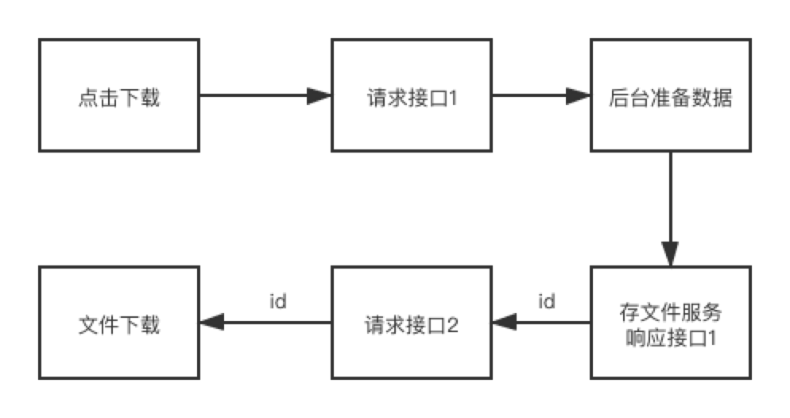

## 前言


> 产品经理: 你这下载按钮点了没反应啊！
> 你: 那是后台太慢了。
> 产品经理: 后台去优化，你给我加一个loading动画


遇到这种情况，以前我都是跟后台商量说: `这个接口返回的是文件流，我捕捉不到，所以没办法判断loading啥时候结束。需要拆成两个接口: `
1. 发起请求，显示loading，告诉后台该整理数据里。
2. 请求回来后loading结束，同时发起另一个请求，下载数据

## 两个接口

就是上面说的方案。

### 流程


1. 前端显示loading。请求`接口1`，传条件，告诉后台准备数据；
2. 后台根据请求值开始准备数据；
3. 后台准备完成后，将数据存成文件放在服务器里，并返回`接口1`；
4. 前端接受到`接口1`的响应后，结束loading，同时请求`接口2`，下载`接口1`准备的文件。



注: 为了保证`接口2`下载的数据是第一次`接口1`所准备的，所以第3步`接口1`的返回值需要给一个`id`。请求`接口2`的时候把`id`带给后台。

### 结论

目测没有什么问题，是的，我之前用的时候也可以满足需求正常使用。但是有一天，后台提出，要多台服务器，做负载均衡。这问题就出现了: `接口1`是A服务器接收的请求，准备的文件也放在了A服务器，但但但`接口2`再请求的时候不一定是A服务器，所以找不到`接口1`准备的文件了。

说： 只定一台服务器放准备的文件即可，我看行，但是没这样做。

## 一个接口

设置响应数据的类型`responseType`为`blob`

### 上代码

```js
function downloadFile(url: string, params: any, cb: any) {
  const ajaxUrl = window.location.origin + url + "?params=" + JSON.stringify(params);
  const xhr = new XMLHttpRequest();
  xhr.open("GET", ajaxUrl, true);
  xhr.responseType = "blob";       // 关键
  xhr.onload = function() {
    if (this.status === 200 || this.status === 201) {
      const blob = this.response;
      const reader = new FileReader();
      reader.readAsDataURL(blob);
      reader.onload = function(e: any) {
      	
        // 文件名由后台控制
        const disposition: any = xhr.getResponseHeader("Content-disposition");
        const arr = disposition.split(";");
        const filenameStr = arr.find((i: string) => i.indexOf("filename") > -1);
        let filename = decodeURI(escape((filenameStr.split("=")[1])));
        filename = filename.split('"').join("");
        
        const El: any = document.createElement("a");
        El.download = filename;
        El.href = El.target.result;
        const root: any = document.getElementById("react-root");
        root.appendChild(El);
        El.click();
        root.removeChild(El);
        cb();
      };
    }
  };
  xhr.send();
}
```

效果如下图，一个接口

