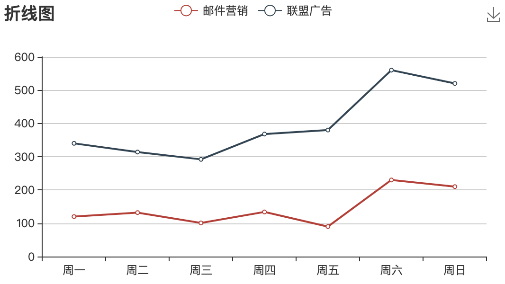
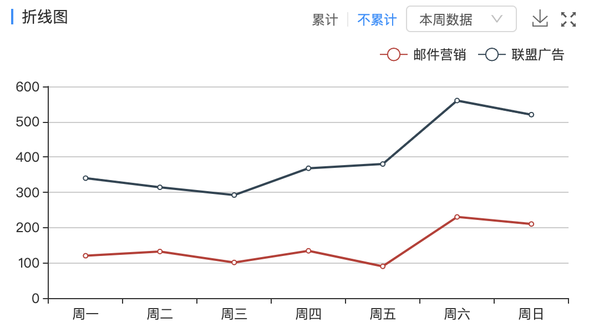
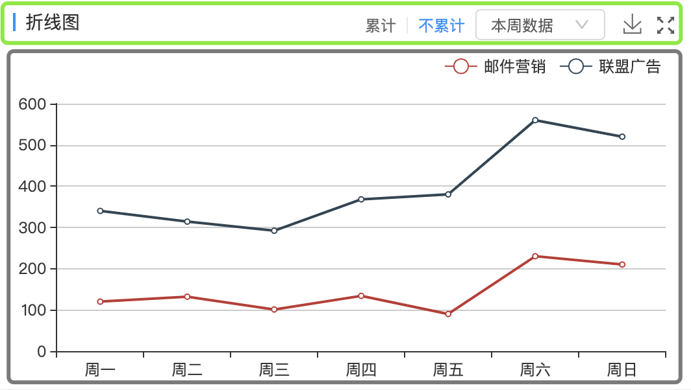

`ECharts`最终是返回一个`canvas`标签，其配置项是已经设定好的，而且部分配置是不支持传入自定义的元素的，所以想要画出丰富的图片，就需要舍弃某些配置，手动封装组件。下面介绍一下保存`ECharts`图片的两种方案。

### 看一下 ECharts 默认保存样式

`ECharts` 的配置 `toolbox.feature.saveAsImage` 显示出保存图片的Icon，如下图是`ECharts`的默认样式。


默认配置如下: 
``` js
option = {
  title: {
      text: "折线图",
  },
  legend: {
      data: ["邮件营销", "联盟广告"],
  },
  grid: {
      left: "3%",
      right: "4%",
      bottom: "3%",
  },
  toolbox: {
      feature: {
          saveAsImage: {}, // show 默认为 true
      },
  },
  xAxis,
  yAxis: {
      type: "value",
  },
  series,
};

```

如果需求很简单，通过配置实现即可。但当需求中的标题样式较复杂或者还有其他其他操作需要和保存Icon并列时，就要放弃`ECharts`的默认样式，自己封装。如下图:



`ECharts`标题的配置不能实现标题左侧的蓝色色条，以及右上角的交互都不是`ECharts`支持的，需要自己实现。下面是我先后用到的两种方案:

### 自定义 ECharts 样式

`标题、按钮、选择框、放大功能不做说明，主要说明保存图片的实现方式.`

#### a标签实现保存图片

1. 可拆分为上下两部分，互不影响。

2. `ECharts`提供了[`getDataURL`](https://www.echartsjs.com/api.html#echartsInstance.getDataURL)的`API`，获取绘制图像的地址。

```js
let href = myChart.getDataURL({
    backgroundColor: '#FFF'
})
```
```html
<header>
    ...
    <a href={href}><Icon /></a>
    ...
</header>
<div className="chart"></div>       // 此时的ECharts配置不需要特殊处理
```
***注:***  *执行`getDataURL`之前，`ECharts`的option必须设置好，否则图片出现空白*

#### 使用ECharts的配置实现保存图片

1. 标题的元素设置绝对定位，并在放大`Icon`前留空间给保存`Icon`
2. `canvas`占据整个空间，图例和`grid`组件容器定位修改

```js
option = {
  legend: {
      data: ["邮件营销", "联盟广告"],
      top: 40,          // 图例下移 留空间给标题
      right: 20,
  },
  grid: {
      top: 80,          // 留空间给标题
      left: "3%",
      right: "4%",
      bottom: "3%",
  },
  toolbox: {
      feature: {
          saveAsImage: {},
      },
      right: 33,        // 右侧有放大Icon
  },
  xAxis,
  yAxis: {
      type: "value",
  },
  series,
}
```

```html
<header style={{position: absolute, ...}}> ... </header>
<div className="chart"></div>       // 此时的ECharts定位要特殊处理
```
***注:*** *此方案保存的图片里是没有标题的*

### 总结

两种方案各有利弊: 

|实现方式|利|弊|
|-|-|-|
|使用a标签|保存的图片属性较全|保存时可能会出现空白现象，必须在ECharts的option设置完成后才能执行getDataURL|
|使用saveAsImage配置|保存时不会出现空白现象|保存的图片里没有标题|