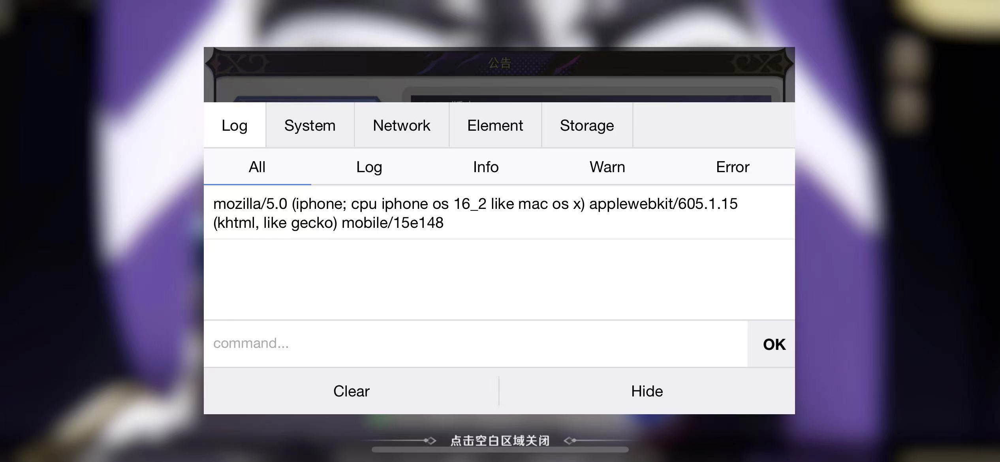

### 问题

IOS设备有默认的`橡皮筋效果`，如下。但是在游戏中是不需要的，在阻止`橡皮筋效果`的过程中就有了下面的过程。

案例代码如下，可以直接复制使用。

```html
<!DOCTYPE html>
<html>
<head>
  <meta charset="utf-8" />
  <meta name="transparent" content="true" />
  <meta content="width=device-width, initial-scale=1.0, maximum-scale=1.0, user-scalable=0;" name="viewport" />
  <title>IOS禁止橡皮筋效果</title>
  <style>
    html, body {
      margin: 0;
    }
    #root {
      display: flex;
      background-color: #fff;
      width: 100vw;
      height: calc(100vh - 20px);
      padding: 10px;
    }
    .left, .right {
      flex: 1;
      height: 100%;
      overflow: auto;
    }
    .right > div {
      margin: 16px;
    }
  </style>
</head>

<body>
  <div id="root">
    <div class="left">
      无滑动区域
    </div>
    <div class="right">
      <div>滑动 1</div>
      <div>滑动 2</div>
      <div>滑动 3</div>
      <div>滑动 4</div>
      <div>滑动 5</div>
      <div>滑动 6</div>
      <div>滑动 7</div>
      <div>滑动 8</div>
      <div>滑动 9</div>
      <div>滑动 10</div>
      <div>滑动 11</div>
      <div>滑动 12</div>
      <div>滑动 13</div>
      <div>滑动 14</div>
      <div>滑动 15</div>
      <div>滑动 16</div>
    </div>
  </div>
</body>
</html>
```

初始的效果如下

<video width="100%" height="440" controls autoplay loop>
  <source src="../../image/IOSPageMove/voice1.mp4" type="video/mp4">
</video>

### 方案

#### 方案1. JS禁止

```html
<script>
  document.body.addEventListener('touchmove', function (e) {
    e.preventDefault();
  }, {
    passive: false
  });
</script>
```

现象: 在webview和浏览器中都有效。但是这个禁用，是一棍子打死的效果，不仅禁用掉了`橡皮筋效果`，页面内部所有元素都都不能滑动了，不合适。  


进一步优化: `touchmove`时可以计算当前元素是否可以滑动，如往下滑动到最底时再往下滑，就阻止掉，否者正常滑动。


结论：由于JS需要频繁的取值计算，效率不高，而且也不能保证计算过程无bug，就放弃了这个方案。


#### 方案2. CSS 脱离文档流

```css
/* 增加以下样式 */
body {
    position: fixed;
    top: 0;
    left: 0;
}
```

现象：在webview和浏览器中都有效。因为脱离文档流了，首次渲染时已经计算好位置，外部页面无论如何滑动，都不影响页面内部的布局。  
问题：并没有真正禁用`橡皮筋效果`，它依旧在，只是外部透明了，用户看不到而已。而在`橡皮筋效果`的过程中，用户感知不到，所以会有滑动失效的错觉，如下，会给用户感觉是bug，体验不太好，放弃。

<video width="100%" height="440" controls autoplay loop>
  <source src="../../image/IOSPageMove/voice2.mp4" type="video/mp4">
</video>


#### 方案3. CSS overscroll-behavior

该属性让你可以控制浏览器过度滚动时的表现 —— 也就是滚动到边界。具体效果参考[张鑫旭的文章](https://www.zhangxinxu.com/wordpress/2020/01/css-overscroll-behavior)

```css
body, .scroll-container {
  overscroll-behavior: none;
}
```

现象：在浏览器中有效，在webview中无效。怀疑是兼容性问题，`overscroll-behavior`属性在低版本浏览器中不兼容，而此游戏的`webview`也获取不到版本信息，或许`webview`就没有对`overscroll-behavior`支持吧。放弃。 




#### 方案4. CSS overflow: hidden

```css
/* 增加以下样式 */
html, body {
  overflow: hidden;
}
```


现象：在webview和浏览器中都可以，`橡皮筋效果`没有了，元素的滑动效果也没受到影响。目前没有什么问题，最终也选择了这个方案。效果如下  


<video width="100%" height="440" controls autoplay loop>
  <source src="../../image/IOSPageMove/voice3.mp4" type="video/mp4">
</video>