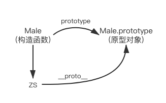

## 前言

`JavaScript`没有`Class`类的概念，是通过原型实现的继承。先看一下下面的代码:

```js
function Male(name){
    this.name = name;
}
Male.prototype.sex = "男";

const ZS = new Male("张三");

console.log(ZS.name);  // 张三
console.log(ZS.sex);   // 男
```

## 原型

### prototype

看第4行代码`Male.prototype.sex = "男";`，函数`Male`有个`prototype`对象属性，并且可以给其赋值。

1. `Javascript`中，每一个函数都有一个`prototype`对象属性，指向的是另一个对象，这个对象叫它`原型对象`。
2. `原型对象`中的所有属性和方法，都会被构造函数的实例所继承，如`sex`属性。所以会把不变的属性和方法，放在`原型对象`中。

构造函数和原型对象之间的关系：


### \_\_proto__

打印`ZS`的时候，你会看到，它不仅仅只有`name`属性，还有`__proto__`属性。这是一个隐式属性


3. 每一个对象(null除外)都会有这个属性`__proto__`，它指向的是`原型对象`。
4. 执行`ZS.__proto__`相当于执行`Object.getPrototypeOf(ZS)`。

```js
console.log(ZS.__proto__ === Male.prototype);  // true
```

关系图如下：


 
 ### constructor

5. 每个原型都有`constructor`属性，是指向对应的`构造函数`。

```js
console.log(Male.prototype.constructor === Male);  // true
console.log(ZS.__proto__.constructor === Male);    // true
```

关系图如下：


## 实例与原型


6. 当读取实例的属性时，如果本身属性找不到，就会查找该对象相关联的原型中的属性。如果还查不到，再往原型的原型中找，一直找到最顶层为止。

如前言中的代码第9行，`console.log(ZS.sex);   // 男`，可以打印出`sex`属性。
- `ZS`对象中找不到`sex`属性，
- 查找`ZS`的原型`ZS.__proto__`的属性，查到了`sex`属性，返回。

等等。。。那如果`ZS.__proto__`也没有查到该属性，那`ZS.__proto__`的原型又是什么呢？

## 原型的原型

正如第3条所说的，每个对象都有原型。`ZS.__proto__`是一个对象，是通过构造函数`Object`创建的，那么`ZS.__proto__`的原型就是`Object`的原型对象。如下:

```js
console.log(ZS.__proto__.__proto__ === Object.prototype); // true
```


## 原型链

`Object.prototype`原型也是一个对象，那它的原型其实是`null`。如下图:


除了null之外，对象都有原型，且对象的原型也是个对象，那么就有对象的原型的原型...一直到没有原型即null，正如上图中蓝色线条，就是一条原型链。

## 总结

1. 对象都有原型(null除外)，原型是个对象
2. 对象的__proto__指向对应的原型，原型的constructor指向对应的构造函数，构造函数的prototype指向对应实例的原型对象
3. 读取对象的属性时，从本身属性到一层一层的原型往上找，直到null。找到了即返回，找不到返回undefined


### 小试牛刀

```js
ZS.__proto__ === Male.prototype  // true
ZS.__proto__.__proto__ === Object.prototype;  // true
ZS.__proto__.constructor === ZS.constructor === Male.prototype.constructor === Male  // true
Male.__proto__ === Function.prototype  // true
ZS.prototype.constructor  // Uncaught TypeError: Cannot read property 'constructor' of undefined
```