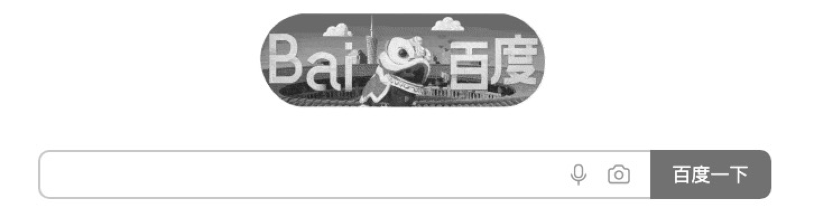
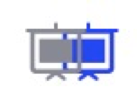
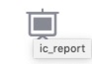
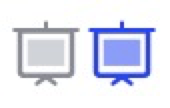

### 前言

事情是这样滴，设计师给出一个图标在蓝湖上，我首选是下载为png格式的图片。前前后后也改了三版。


### 第一版 png格式的icon

#### 为什么使用png

1. 图片不会被打包进`bundle.js`中，不会增加包的体积
2. 图片可以被`缓存`起来，仅第一次请求时需要下载，后续直接读取缓存副本显示，而且图标图片大小不会很大

#### 高亮时怎么变色

都知道图片不是元素，不能通过`color`或者`background-color`来修改颜色，那么高亮时怎么换色呢？

#### filter drop-shadow

`filter`是将模糊或者颜色的图形效果应用在元素上的CSS属性。

1. 一些特殊日子，或者清明节时，某些官网和账号的头像会变灰色，就是CSS一个属性搞定的。
```css
html{
    filter: grayscale(1);
}
```


2. 模糊(马赛克)，比如打开详情页时，突然发现你的session失效了，产品经理只想在当前页让用户输入账号，又不想让用户看到里面的信息
```css
html{
    filter: blur(10px);
}
```


`更多属性请查看 `[filter属性](https://developer.mozilla.org/zh-CN/docs/Web/CSS/filter)

3. 我用到的是 `drop-shadow` 阴影效果。直接看代码
```css
html{
    filter: drop-shadow(18px 0px #2142FA);
}
```


是根据原有图形，创建一个阴影，向左偏移18px, 向下偏移0px，阴影颜色是`#2142FA`，还省略一个模糊设置，默认是0px所以没写。
再把原有图形隐藏掉，阴影移动到原来图形的位置即可。


```css
html{
    filter: drop-shadow(100px 0px #2142FA);
    left: -100px;
}
```


### 第二版 png失真处理

png图片看着会有一点模糊，所以改用svg格式。
从蓝湖上下载的文件格式，换成svg。引入`react-svg-inline`库，配置好svg即可。

#### 小细节

`测试发现鼠标悬浮时，出现了tips`

我确信我没有添加`title`属性，难道是`react-svg-inline`引入了? 排查一下也没有啊啊。
原来是SVG里带的，第四行。我这边就删除了三四五这3行
```xml
<?xml version="1.0" encoding="UTF-8"?>
<svg width="38px" height="37px" >
    <!-- Generator: Sketch 57.1 (83088) - https://sketch.com -->
    <title>ic_report</title>  <!-- 生成的悬浮效果，删除 -->
    <desc>Created with Sketch.</desc>
    <g id="页面-1" stroke="none" stroke-width="1" fill="none" fill-rule="evenodd">
        <g id="data360" transform="translate(-52.000000, -230.000000)" fill-rule="nonzero">
            <g id="ic_report" transform="translate(51.000000, 228.000000)">
                <path d="..." id="形状" fill="#878A94"></path>
            </g>
        </g>
    </g>
</svg>
```

#### 渲染SVG图标

引入`react-svg-inline`，用`span`标签包裹起来，方便设置svg里的颜色

```html
import SVGInline from "react-svg-inline";
<Svg fillColor={fillColor} svgWidth={svgWidth} svgHeight={svgHeight}>
    <SVGInline svg={svgPath} />
</Svg>

使用

<SVGComponent
    svgWidth={34} svgHeight={34}
    svgPath={require("../../images/ic_report.svg")}
    fillColor={active ? "#2142FA" : "#878A94"}
/>

```

```scss
const Svg = styled.span`
    ... 省略一些样式设置
    svg {
        path {
            fill: ${(props) => props.fillColor} !important;
        }
    }
`
```

#### 更换成SVG完成

这就完成了从`png`到`svg`的调整。

1. 蓝湖里下载的svg图片
2. svg文件中去除`title`等多余标签
3. 引入`react-svg-inline`，设置填充色

### 图标美化

`设计师又出了一版图标，原来标图同时只有一个色号，现在出现了两种色号`



下载svg格式后，同样删除多余的`title`属性时，发现多了一个标签`rect`画矩形。
```xml
<?xml version="1.0" encoding="UTF-8"?>
<svg width="38px" height="37px" >
    <g id="页面-1" stroke="none" stroke-width="1" fill="none" fill-rule="evenodd">
        <g id="data360" transform="translate(-52.000000, -230.000000)" fill-rule="nonzero">
            <g id="ic_report" transform="translate(51.000000, 228.000000)">
                <rect id="矩形" fill="#000000"></rect>  <!-- 新加的标签 -->
                <path d="..." id="形状" fill="#878A94"></path>
            </g>
        </g>
    </g>
</svg>
```
这样好办啊，填充颜色时，给`rect`单独设置颜色即可


#### 渲染SVG图标


```html
import SVGInline from "react-svg-inline";
<Svg fillColor={fillColor} rectColor={rectColor} svgWidth={svgWidth} svgHeight={svgHeight}>
    <SVGInline svg={svgPath} />
</Svg>

使用

<SVGComponent
    svgWidth={34} svgHeight={34}
    svgPath={require("../../images/ic_report.svg")}
    fillColor={active ? "#2142FA" : "#878A94"}
    rectColor={active ? "#8A9CFF" : "#D0D3D8"}
/>

```

```scss
const Svg = styled.span`
    ... 省略一些样式设置
    svg {
        path {
            fill: ${(props) => props.fillColor} !important;
        }
        rect {
            fill: ${(props) => props.rectColor} !important;
        }
    }
`
```


#### 事情并不简单

事情并不简单，单纯的设置`rect`的颜色，耦合性太高。例子中的图标比较简单，设计师后几个图标就比较乱。
所以这边也手动维护乱一下svg文件，`给标签添加类，通过类名设置填充色`。

```xml
<?xml version="1.0" encoding="UTF-8"?>
<svg width="38px" height="37px" >
    <g id="页面-1" stroke="none" stroke-width="1" fill="none" fill-rule="evenodd">
        <g id="data360" transform="translate(-52.000000, -230.000000)" fill-rule="nonzero">
            <g id="ic_report" transform="translate(51.000000, 228.000000)">
                <rect class="rectColor"></rect>  <!-- 维护类名 -->
                <path class="fillColor" d="..." id="形状" fill="#878A94"></path>
            </g>
        </g>
    </g>
</svg>
```

```scss
const Svg = styled.span`
    ... 省略一些样式设置
    svg {
        .fillColor {
            fill: ${(props) => props.fillColor} !important;
        }
        .rectColor {
            fill: ${(props) => props.rectColor} !important;
        }
    }
`
```

### 总结

1. `png`会失真，如果让设计师提供像素更高的图标，`png`看上去不会失真，但是第三版的图标看，还是需要换成`svg`格式的
2. 通过维护`svg`文件的类名，填充不同的颜色，虽然能达到，但维护成本大，更换图标还需要再维护
3. 更换`svg`后`bundle.js`增加了8KB(Gzipped size)