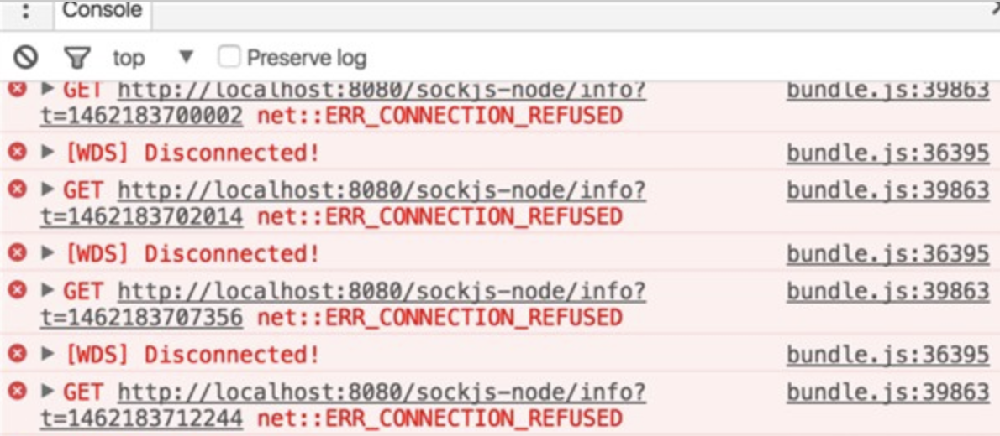

### sockjs-node 报错

项目本地运行时一直报 sockjs-node/info 接口的错误，如下图:



### 解决方法

1. 找到/node_modules/sockjs-client/dist/sockjs.js，
2. 找到代码的 1605行，
```js
try {
    // self.xhr.send(payload);
} catch (e) {
    self.emit('finish', 0, '');
    self._cleanup(false);
}
  ```
3. 解决。