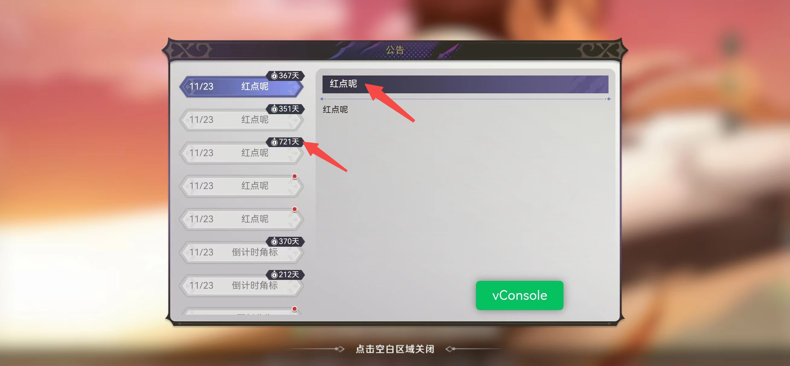

### 一起看看

此坑是在`Overload`的公告页面中遇到的。开发是在PC上，调试时是在手机浏览器里，并没发现问题。  
但更新后，用游戏客户端打开，有些地方上下不居中。有的偏上，有的偏下。如下图  
如果是你，你会怎么处理呢？




### 尝试修改

前后尝试了常见的居中方式: 
1. line-height的值和行高相等  
2. 绝对定位+偏移  
```css
.title {  
      position: absolute;
      top: 50%;
      transform: translate(0,-50%);
}
```

3. flex布局  
```css
.title {
      display: flex;
      align-items: center;
}
```

结果是：在手机浏览器上测试都是上下居中的，就游戏客户端里没效果。

后来为了避免其他代码影响，就写了一个单页面来测试，结果依旧。如下图   

   


这时是不是认为肯定是客户端设置某些值引起的😠。就带着测试结果找客户端的同事一起排查了。但结果很遗憾，客户端并没有特殊配置。又打回原形从头再来了，再次查资料找方案。  
后来翻到一篇文章，文中说到一种方案：放大后再缩小。起初的想法是缩小后误差也会小，即使解决不了，至少也会美观一点。

#### 最终方案

经过几次测试，最终修复方案:看一下代码
```html
<style>
    /* new */
    html {
        transform: scale(0.5);
        transform-origin: 0 0;
    }
    #root{
        width: 200vw;
        height: 200vh;
    }
</style>
<script>
  // old
  html.style.fontSize = value + 'px'
  // new
  html.style.fontSize = value * 2 + 'px'
</script>
```
即将所有元素放大两倍，画布放大两倍，再从最外层缩小一半。搞定！  
用到`rem`，所以html元素字体乘2，那所有元素也会方法两倍，原来字体5px的现在是10px，
12px的现在是24px。  
猜测: 是元素字体小于了游戏客户端`webview`支持的最小字体导致的。有兴趣的可以验证一下😄