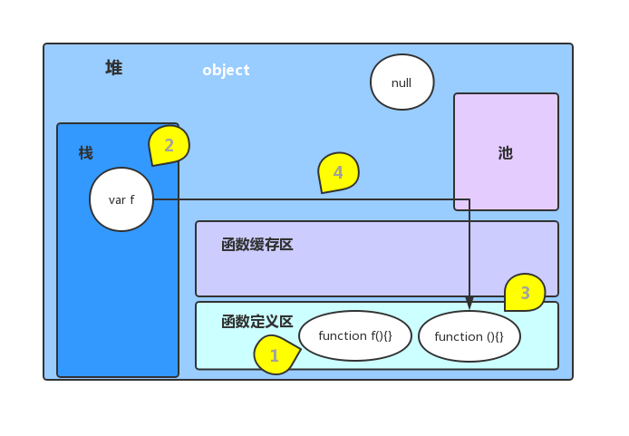
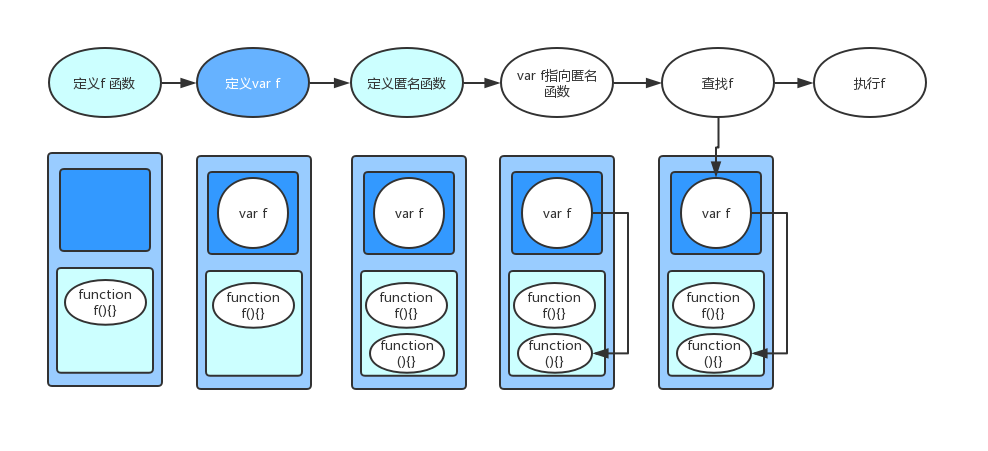
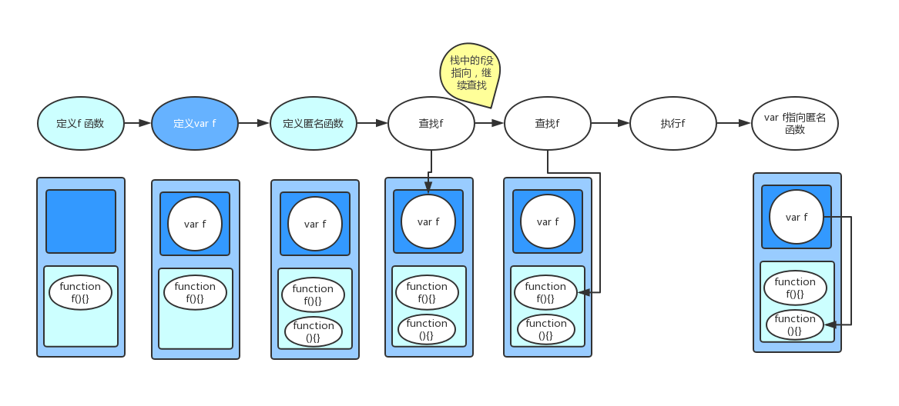

---
title: 函数的定义和区别
date: 2019-04-29
description: 函数的定义有多种，不同的定义方式，使得代码运行稍有差别，本篇用例子解释了函数的定义、执行。
tags: [js基础, 整理]
---


### 函数定义方式
1. 函数声明
```js
function funcName(){
    // code
}
```
2. 函数表达式(函数字面量)
```js
var funcName = function (){
    // code
}
```
3. 构造函数
```js
var funcName = new Function('x', 'y', 'console.log(x, y)');
```

### 例子

例1

```js
function f () {          // 为了区分，下面把该函数叫func1
    console.log('f1');
}
var f = function () {    // 为了区分，下面把该函数叫func2
    console.log('f2');
}
f();
```

输入内容 `f2`。有人可能认为因为`func2`的定义在后面，覆盖了前面的`func1`。其实并不然，把`func1`和`func2`互换一下位置，看看输出的内容是不是和你想的一样呢～～其实也同样输出`f2`。

但是如果把`f()`提前执行呢:

例2

```js
f();
function f () {
    console.log('f1');
}
var f = function () {
    console.log('f2');
}
```

输出内容`f1`


 
 ### 分析

 
1. 其实`func1`和`func2`两种方式声明的函数是不一样的。`func1`声明的函数直接放在了`函数定义区`；而`func2`先定义一个变量`f`放在`栈`中，又定义了一个匿名函数放在`函数定义区`，再把变量`f`指向匿名函数。
2. js是单线程的，代码是一步一步往下执行的，这句话并不完全正确。js会从上到下先把定义执行完(图片中的1，2，3)，再执行操作语句。
3. 执行语句时，遇到变量先从`栈`里找，如果没有该变量或者该变量没有指向其他值，继续从`函数定义区`里找。



所以在例1中，先定义`func1`在`函数定义区`、`var f`在`栈`、匿名函数`函数定义区`；将`f`指向匿名函数；查找f、从`栈`找到了`f`并指向函数；执行`f()`时会执行匿名函数，所以输出的是`f2`。

在例2中，先定义`func1`在`函数定义区`、`var f`在`栈`、匿名函数`函数定义区`；查找f、从`栈`找到了`f`但是指向其他值，所以从`函数定义区`里找到了，执行，所以输出的是`f1`


### 总结

1. 字面量声明的函数与普通声明不同，会占用更多的内存。
2. js执行顺序: 先定义变量和声明函数，再执行相关操作。
3. js查找变量顺序: 先在栈中查找，再在函数定义区中查找。

### 延伸

1. 总结第1点，会不会与性能有关？字面量声明方式虽然占用内存多，但是从总结的第3点可以看出查找速度较快。
2. 总结第2点，是不是和变量提升有关？
3. 栈中的变量，是否被定义、是否有指向、函数定义区是否有声明，会怎么样影响查找结果?
```js
var f;
function f () {}
console.log(typeof f);          // function
console.log(f);                 // ƒ f(){}

var f = null;
function f () {}
console.log(typeof f);          // object
console.log(f);                 // null

var f = undefined;
function f () {}
console.log(typeof f);          // undefined
console.log(f);                 // undefined
```